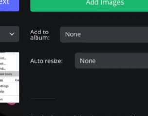
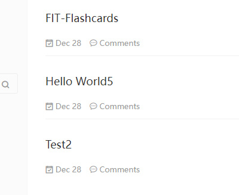

<!--question-->

otazka1

<!--answer-->

## What's the Markdown?

Markdown is a lightweight markup language with plain-text-formatting syntax.
Its design allows it to be converted to many output formats,
but the original tool by the same name only supports HTML.

## Who created Markdown?

John Gruber created the Markdown language in 2004 in collaboration with
Aaron Swartz on the syntax.

###### karel

blablablax

[#tag1]()

<!--question-->

otazka2

<!--answer-->

odpoved2

[#tag1]() [#tag2]()

<!--question-->

otazka3

<!--answer-->

odpoved3

[#tag1]() [#tag2]() [#tag3]()

<!--question-->

Jak se vaří brambora? +ěšřčžčžčáčýéčšž

<!--answer-->

$x+y=1$;

<!--question-->

Jak se vaří brambora? 2 +ěšřčžčžčáčýéčšž

<!--answer-->

$$\frac{\mathrm{d}(U V)}{\mathrm{d} a}=\left\langle\begin{array}{l} \frac{\mathrm{d} U}{\mathrm{~d} a} V, \text { pokud } \varepsilon \notin h(U), \\ \frac{\mathrm{d} U}{\mathrm{~d} a} V+\frac{\mathrm{d} V}{\mathrm{~d} a}, \text { pokud } \varepsilon \in h(U) \end{array}\right.$$;
